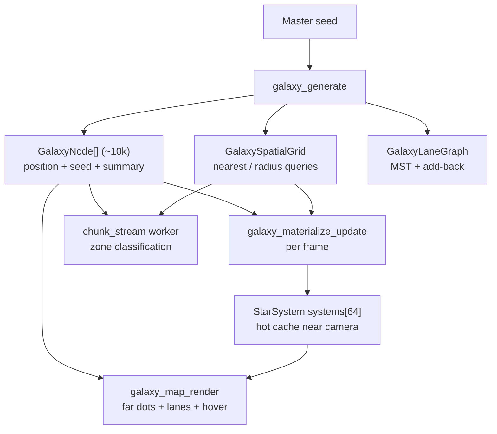

# Galaxy Generation Architecture

> Status: **implemented and shipping**. This describes the procedural galaxy generator as built
> (star cluster placement, physical star/planet properties, spatial index, travel lanes, lazy
> materialisation, LOD rendering, and hover inspection). It supersedes the exploratory
> `MAP_GENERATION_DESIGN_NOTES.md`.

---

## 1. Overview

The game world is a single galaxy of **~10,000 star systems** distributed on a gaussian disc,
generated **deterministically from one master seed**. Everything lives in **one continuous
`HierPos2` floating-origin world space** — you fly between systems; there is no separate "map
coordinate space".

Two design pillars make 10k systems cheap:

1. **Two-tier data model.** The whole galaxy is a flat array of lightweight `GalaxyNode`s (position
   + seed + summary attributes). Full star systems (star + planets + orbits) are **materialised
   lazily** into a small hot cache only for systems near the camera.
2. **Determinism everywhere.** Each node's contents are a pure function of its seed, so anything can
   be regenerated on demand (hover inspection, chunk streaming, cache eviction/re-entry) without
   storing it.



---

## 2. Data model (two tiers)

### Tier 1 — the whole galaxy: `GalaxyNode[]`
A heap array of ~10,000 lightweight records (~88 bytes each, ~0.9 MB total). A node holds only what
is needed to place a dot, label it, light it, classify chunk zones, and re-derive the full system:

```
struct GalaxyNode {
    bs_math::HierPos2 galaxy_center; // absolute galaxy position
    u64          seed;               // -> deterministic full materialisation
    bs_color     star_color;         // summary (map dot + lighting)
    f32          star_radius;        // summary (dot size / lighting)
    f32          orbit_radii[5];     // sorted; chunk zone classification
    i32          orbit_count;
    char         name[8];            // unique catalogue designation ("N327B"); "Sol" = home
};
```

### Tier 2 — the hot cache: `StarSystem systems[GALAXY_MAX_SYSTEMS]`
`GALAXY_MAX_SYSTEMS = 64`. This array **no longer stores the whole galaxy** — it is a small LRU
working set of *fully materialised* systems (star + planets + orbit phases + physical properties)
for the nodes nearest the camera. `cache_node[i]` maps cache slot `i` back to its galaxy node index
(`-1` = empty). `current_system` is the cache slot of the system under the camera.

Both tiers, plus the spatial index and lane graph, live in the `GalaxyState` sub-struct of
`game_state` (`s->galaxy`).

---

## 3. Core data structures

| Struct | Where | Purpose |
|---|---|---|
| `GalaxyNode` | game_state.h | Lightweight per-system record (whole galaxy). |
| `GalaxyState` | game_state.h | Owns `nodes`, `grid`, `lanes`, hot cache `systems[64]`, `cache_node[]`, `current_system`, map entities, map UI state. |
| `StarSystem` | game_state.h | Full materialised system: `star`, `planets[5]`, `star_props`, `planet_props[5]`, orbit/animation state, `name`. |
| `CelestialBody` | game_state.h | Render+orbit data for a star or planet (position, radius, color, Keplerian elements). |
| `StarProperties` | game_state.h | Physical star attributes (class, mass, temp, luminosity, radius, age, metallicity, HZ, frost line). |
| `PlanetProperties` | game_state.h | Physical planet attributes (type, orbit AU, mass, radius, temperature, habitability, atmosphere). |
| `GalaxySpatialGrid` | sim/galaxy_spatial.h | Counting-sorted CSR bucket grid for nearest/radius node queries. |
| `GalaxyLaneGraph` | game_state.h | Flat lane edge list + CSR adjacency (travel connectivity). |

---

## 4. Determinism & seeding

- One **master seed** (`GALAXY_MASTER_SEED = 0x9E3779B97F4A7C15` in galaxy_map.cpp) drives the whole
  galaxy.
- Per-node seed = `galaxy_seed_for(master, index)` = `splitmix64(master ^ (0x9e37… · (index+1)))`
  (index-invariant, so adding/removing systems never disturbs an unrelated index).
- A node's **contents** derive from its seed via `generate_star_system(seed)`, which internally
  derives independent sub-seeds for the star (`seed ^ 0xA24B…`) and each planet
  (`seed ^ (0xC2B2… · (i+1))`).
- Shared PRNG utilities live in `sim/galaxy_rng.h` (`galaxy_splitmix64`, `GalaxyRng`,
  `galaxy_rng_range`, `galaxy_seed_for`).

**Payoff:** save/load can persist just the seed (+ future player-caused deltas), not a serialised
galaxy; and any system can be reconstructed anywhere (hover, streaming, cache re-entry) identically.

---

## 5. Generation pipeline (`galaxy_generate`, sim/galaxy_gen.cpp)

Runs once at `galaxy_map_init`. Three phases:

1. **Placement — `place_nodes`** (gaussian disc + blue-noise rejection)
   - Radius sampled Rayleigh: `r = σ·√(−2·ln u)` (the radial marginal of a 2-D gaussian → dense
     core, smooth falloff, no arms), angle uniform. Rare `r > R_max` re-rolled.
   - **Minimum-separation guarantee:** a temporary uniform hash grid (cell = min separation)
     rejects any candidate within `GALAXY_MIN_SEPARATION` of an already-placed system (3×3
     neighbour scan, ≤32 re-rolls). This prevents the close pairs a pure gaussian would produce, so
     neighbouring systems' orbits can never intersect.
   - Node 0 is pinned to the origin ("Sol", the home/start system).
   - Precise position stored via `hierpos_add_f64` from f64 coords (avoids the lossy f32 round-trip
     `generate_star_system` would otherwise do at 4e10 units).
   - Each node's **summary** (`star_color`, `star_radius`, sorted `orbit_radii`) is snapshotted by
     running `generate_star_system` once and discarding the full system.

2. **Spatial index — `galaxy_grid_build`** (see §7).

3. **Lane graph — `build_lanes`** (see §8).

---

## 6. Worldgen: physical star & planet properties (ss_generation.cpp)

Dwarf-Fortress-style derivation chain — **a star's properties determine its planets**:

```
seed -> StarProperties -> (habitable zone + frost line) -> per-orbit PlanetType -> PlanetProperties
```

### Star (`worldgen_star`)
- **Spectral class** from a weighted table `WG_CLASS[7]` matching the real distribution
  (M ≈ 76%, K, G, F, A, B, O ≈ 0.01%).
- Class fixes ranges for mass, temperature, radius. Luminosity `L = M^3.5 · jitter`. Age uniform up
  to `min(12, 10·M^-2.5)` Gyr (O/B young, M ancient). Metallicity 0.2–2.5 (biases planet count and
  giant frequency).
- Derived: **habitable zone** `hz_inner = √(L/1.1)`, `hz_outer = √(L/0.53)`; **frost line**
  `4.85·√L` (all AU). Render tint via `blackbody_color(temperature)` (Tanner-Helland approximation).

### Planets (`worldgen_planet`, per orbit)
- **Type** by orbital distance relative to that star's HZ/frost: `LAVA` (inside the hot edge) →
  `ROCKY`/`DESERT` → **temperate band** `[0.7·hz_inner, 1.3·hz_outer]` → `OCEAN`/`TERRAN`/`DESERT`
  → cold rocky → `GAS_GIANT` → `ICE_GIANT` → `FROZEN`.
- Mass/radius by type; equilibrium temperature `T = 255·L^0.25 / √(a_AU)`; habitability heuristic
  for ocean/terran worlds (temperature centred on ~240 K equilibrium + Earth-like mass); atmosphere
  flag. Render color from type (with per-planet jitter).

### Orbit → AU mapping (the key trick)
Orbits are generated in **bounded world units** (so every system physically fits the 2e8 galaxy
spacing), then **log-mapped per system into `[0.35·hz_inner, 2.5·frost]` AU** using the actual
(randomised) orbit ratios. Consequently:
- The **star's luminosity** decides *which* planets are habitable / giant / frozen.
- Every system still spans hot → habitable → icy, and no O-star system grows light-years wide.
- Side effect: the innermost planet sits at a ~fixed HZ-relative distance (≈441 K), which is
  physically correct.

---

## 7. Spatial grid (sim/galaxy_spatial.cpp)

A **counting-sorted CSR bucket grid** over the disc, built once and never mutated (so all queries
are pure reads — safe to call lock-free from the chunk worker thread).

- `cell_size = GALAXY_GRID_CELL` (≈ inter-system spacing → 1–2 nodes/cell).
- `galaxy_grid_nearest(grid, nodes, wx, wy)` — expanding-ring nearest search (replaces the old O(N)
  Voronoi scan and its 64-site cap).
- `galaxy_grid_query_radius(grid, nodes, wx, wy, r, out, max)` — gather nodes within a radius.

Used for: materialisation candidate gathering, `galaxy_nearest_node` (parallax anchor, HUD, hover,
gameplay current-system), kNN in lane building, and chunk zone classification.

---

## 8. Lane graph (`build_lanes`, sim/galaxy_gen.cpp)

A **visual star-chart overlay** connecting nearby systems. **Travel is seamless and unconstrained —
there are no jump points, so lanes are NOT routes the player must follow.** They are a
relational/aesthetic layer (and a hook for future fast-travel hints), not a travel constraint. The
algorithm still produces a fully connected, interesting graph:

1. **kNN candidate edges** (k = 8) via the grid; canonicalised (`a<b`) and deduped.
2. **Kruskal MST** over candidates (union-find) → spanning tree (no unreachable system).
3. **Add-back** ~20% (`GALAXY_LANE_ADDBACK`) of leftover kNN edges, chosen deterministically, for
   loops/alternate routes.
4. **Component bridges:** any leftover disconnected components are joined along the spatially
   coherent grid order (short bridges) to guarantee full connectivity.
5. Compacted into exact-size `lane_a[]`/`lane_b[]` + a **CSR adjacency** (`adj_start`,
   `adj_neighbor`) for O(1) neighbour iteration.

---

## 9. Lazy materialisation (sim/galaxy_map.cpp)

`galaxy_materialize_update(s)` runs early each frame:

1. Query the grid for nodes within `GALAXY_MATERIALIZE_RADIUS` (3e8) of the camera; keep the nearest
   `GALAXY_MAX_SYSTEMS`.
2. **Reconcile** the hot cache: evict slots whose node left range (compacting in place to preserve
   the orbit-animation state of systems that stay); materialise newcomers via
   `generate_star_system(node.seed)`, then overwrite `galaxy_center`/`name` from the node.
3. Set `current_system` to the cache slot of the nearest node.

`galaxy_map_update_orbits` then advances Keplerian motion for **cached systems only** — not all 10k.
`galaxy_nearest_node` / `galaxy_ensure_materialized` are the public helpers other systems use.

---

## 10. Rendering & LOD (render/galaxy_map_render.cpp)

`draw_galaxy_map_look` runs whenever `view_arena_w < 1` (galaxy look faded in). LOD keeps the sprite
count bounded (the backend batch caps at 16,384 sprites and logs per-dropped-sprite — overflow was a
hard ~1 FPS stall):

- **Far-system dots — `draw_galaxy_overview`:** one quad per node (not a 6-line circle), deduped via
  a frame-stamped 2 px **screen-occupancy grid** (dense core collapses to one dot/pixel), capped by
  `GALAXY_OVERVIEW_BUDGET = 12000`. Travel lanes drawn only when longer than ~6 px on screen.
- **Detailed passes** iterate the hot cache: Pass 1 selects ≤4 "sunburst" hero stars; Pass 2 draws
  planets/orbit rings/labels but **LOD-culls** systems that are off-screen or whose orbits are
  sub-6 px.
- **Hover tooltip:** `mouse_true_hierpos` → `galaxy_nearest_node`; if the cursor is within ~22 px of
  the system's dot, `generate_star_system(node.seed)` reconstructs it and `galaxy_map_hover_tooltip`
  (built game-side in `game_push_hud`, drawn by the RmlUi HUD `#tooltip`) shows
  name, spectral class + temperature, luminosity, age, and each planet's type / orbit / temperature
  (flagging habitable worlds). Defers to the ship-marker tooltip; suppressed over UI panels.

The retired global Voronoi (`voronoi_galaxy.*`, `voronoi_cell_hover_effect.*`) is no longer generated
or drawn at 10k scale (files remain but are unused by this path).

---

## 11. Coordinate model & zoom

- **HierPos2** (integer `GridCell` + f32 `local`, cell size 16,384) gives exact precision anywhere in
  the ~4e10-unit galaxy; render offsets use `hierpos_diff` to avoid f32 cancellation.
- **Linear render space**: positions render linearly at every zoom (`render = world - camera_hierpos`,
  then camera2d applies zoom). There is no cosmetic distance compression; the same transforms are used
  in the map and arena renderers so there is no seam across the cross-fade.
- **Depth parallax** for the celestial backdrop uses one shared per-frame anchor (the camera's
  system centre) so systems keep their relative layout at any depth (see
  `CELESTIAL_PARALLAX_SYSTEM` notes / `sim/celestial_parallax.cpp`).
- **Zoom-out limit** `ZOOM_GLOBAL_MIN = 6e-9` (sim/camera_controller.cpp) is sized so the wheel can
  pull back far enough to frame the whole 4e10 disc; the extra decades are traversed quickly via the
  progressive `g_zoom_out_speed_gain` zoom-out speed ramp.

---

## 12. Chunk-stream integration (sim/chunk_stream.cpp)

The background chunk-generation worker classifies each chunk's "zone" (belt / fringe / inner …) by
its nearest star system. It holds **const pointers to the immutable node array + spatial grid** and
calls `galaxy_grid_nearest` — scaling to 10k systems instead of the old fixed 64-system snapshot.
Because those arrays are built once and never mutated, the worker reads them lock-free.

---

## 13. Naming

Every system gets a **unique catalogue designation** `L###L` (e.g. `N327B`) from
`galaxy_system_name(index)`. Uniqueness is guaranteed (not merely random) by a **bijective LCG**:
`s = (index·48271 + 12345) mod 676000` — since 48271 is coprime to 676,000, distinct indices always
produce distinct names. Node 0 keeps the human-readable home name "Sol".

---

## 14. Key files

| File | Responsibility |
|---|---|
| `sandbox/source/sim/galaxy_gen.{h,cpp}` | Node placement (gaussian disc + blue-noise), summary attributes, lane graph, unique names, `galaxy_generate` / `galaxy_free`. |
| `sandbox/source/sim/galaxy_spatial.{h,cpp}` | Spatial bucket grid (`galaxy_grid_build/nearest/query_radius`). |
| `sandbox/source/sim/galaxy_map.{h,cpp}` | `galaxy_map_init`, lazy materialisation, orbit update, `galaxy_nearest_node`, map upkeep. |
| `sandbox/source/sim/galaxy_rng.h` | Deterministic splitmix64 PRNG + seed derivation. |
| `sandbox/source/ss_generation.{h,cpp}` | Worldgen star/planet property model + Keplerian orbit generation (`generate_star_system`). |
| `sandbox/source/state/game_state.h` | `GalaxyNode`, `GalaxyState`, `StarSystem`, `StarProperties`, `PlanetProperties`, enums. |
| `sandbox/source/render/galaxy_map_render.cpp` | LOD dot/lane rendering, detailed passes, hover tooltip. |
| `sandbox/source/sim/chunk_stream.{h,cpp}` | Per-chunk content streaming; nearest-system via node array + grid. |
| `sandbox/source/core/view_transform.cpp` | Cosmetic compression + arena/map view weight. |
| `sandbox/source/sim/camera_controller.cpp` | Zoom limits (`ZOOM_GLOBAL_MIN`). |

---

## 15. Tunables (galaxy_gen.h / galaxy_map.h)

| Constant | Value | Meaning |
|---|---|---|
| `GALAXY_TARGET_SYSTEMS` | 10000 | System count (clamp on `galaxy_generate`). |
| `GALAXY_DISC_SIGMA` | 1.0e10 | Gaussian disc scale (central spacing ≈ σ·√(2π/N) ≈ 2.5e8). |
| `GALAXY_DISC_RMAX` | 4.0e10 | Disc radius clamp (~4σ). |
| `GALAXY_MIN_SEPARATION` | 2.0e8 | Blue-noise minimum spacing (≥ biggest system's orbit diameter). |
| `GALAXY_GRID_CELL` | 2.5e8 | Spatial grid cell edge. |
| `GALAXY_KNN_K` | 8 | Neighbours per node for the lane graph. |
| `GALAXY_LANE_ADDBACK` | 0.20 | Fraction of non-tree kNN edges kept as loops. |
| `GALAXY_MAX_SYSTEMS` | 64 | Hot-cache size (max detailed systems at once). |
| `GALAXY_MATERIALIZE_RADIUS` | 3.0e8 | World radius around camera that materialises in full. |

---

## 16. Capacity limits

- **As configured:** exactly **10,000** (`GALAXY_TARGET_SYSTEMS` clamp).
- **Unique names:** **676,000** designations before the `L###L` bijection wraps (widen the format to
  lift it).
- **Spatial packing (current disc):** ≈ **145,000** max at 2e8 spacing within a 4e10 disc; fewer in
  practice as the gaussian core saturates (rejection is capped at 32 tries). Grow `σ`/`R_max` for
  more.
- **Index type:** node index/count are `i32` → **~2.15 billion**; seeds are 64-bit (no collision).
- **Real ceiling:** memory (~88 bytes/node) and O(N log N) generation — millions are feasible with
  parameter scaling; billions are not.

---

## 17. Known limitations / future work

- **Seamless, unconstrained travel (no jump points).** By design the player moves/jumps freely
  across and between star systems — there are no discrete jump points and no lane-constrained
  routes. The whole galaxy is already one continuous `HierPos2` space, so travel is just
  position/velocity integration over that space (as the flight sim already does); no
  `system ↔ cluster` coordinate-space switch is planned. The lane graph (§8) is therefore purely a
  visual/relational overlay, not a travel constraint. A long-range "jump" affordance (instant or
  fast reposition) can be layered on top without any route restrictions.
- **No moons, rings, minerals/resources, factions, or economy.** These hang off the property layer
  later.
- **Habitable-world frequency** is a fixed default; intended to become a "new galaxy" setup option
  (see below).
- **Planned `GalaxyGenParams`.** The scattered `static const` tunables should become a params struct
  filled by a game-start "generate galaxy" window (seed, size, core concentration, stellar age,
  abundance of life, lane density…), with today's constants as defaults.
- **Save/load** is not wired, but the deterministic seed model makes it cheap when added.
