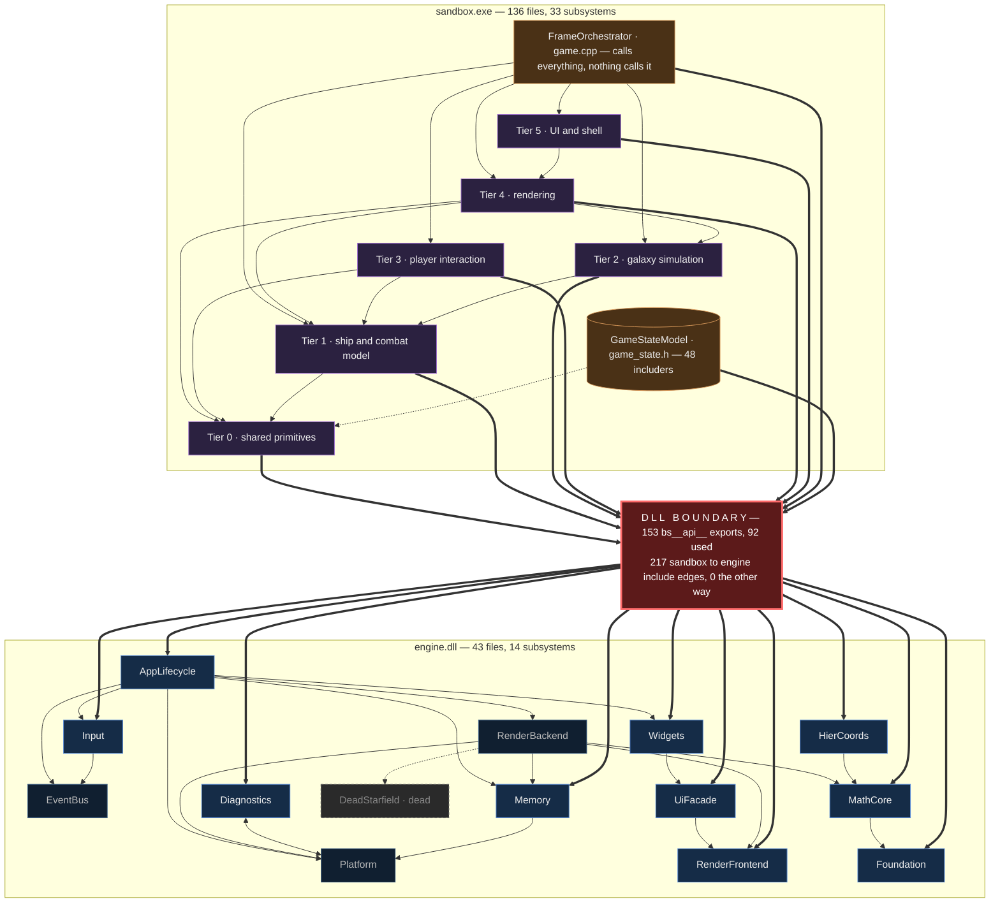

# Black Stride — architecture index

**How to use this doc.** Read *this file* at the start of every session — it is the only
architecture doc meant to be loaded unconditionally. Use the map and tables below to work out
which subsystems the current task touches, then open **only those** pages. Each carries its own
interface, dependencies, invariants, extension points and tech debt; that is where depth lives.
Do not read the whole tree — 47 pages plus the raw notes run to several hundred KB, and loading
them wholesale crowds out the code you are actually changing. If you are working on the
engine/sandbox seam, add [engine-api-boundary.md](engine-api-boundary.md): it is the only doc
covering ownership, lifetime and ABI across the DLL.

---

## Map



Arrows read *depends on*. The red bar is the DLL seam — every sandbox→engine call passes through
it. **Four engine subsystems are never included by the sandbox** (dimmed: RenderBackend,
EventBus, Platform, DeadStarfield), which is the intended encapsulation holding. Per-subsystem
edges live on the individual pages under **Depends on** / **Depended on by**; the tier grouping
here summarises them, it does not replace them.

---

## Engine subsystems — `engine.dll`

| Subsystem | Responsibility |
|---|---|
| [AppLifecycle](engine/AppLifecycle.md) | Startup/shutdown order, the frame loop, and the `Game` callback contract. |
| [Diagnostics](engine/Diagnostics.md) | Levelled log output and the assertion-failure reporter. |
| [EventBus](engine/EventBus.md) | Code-indexed publish/subscribe with synchronous first-handler-wins dispatch. |
| [Foundation](engine/Foundation.md) | Scalar typedefs, `TRUE`/`FALSE`, platform detection, and the `bs__api__` export macro. |
| [HierCoords](engine/HierCoords.md) | Galaxy-scale positions as `i64` cell plus local `Vec2`, canonicalised and arithmetic-safe. |
| [Input](engine/Input.md) | Keyboard/mouse snapshots, the wheel accumulator, and edge-to-event conversion. |
| [MathCore](engine/MathCore.md) | `Vec2/3/4` and `Mat4` under a fixed column-major, Vulkan-clip convention. |
| [Memory](engine/Memory.md) | Tagged heap allocation with per-tag accounting, plus a reserve/commit arena. |
| [Platform](engine/Platform.md) | SDL3 window, event pump, virtual memory, coloured console, and timing. |
| [RenderBackend](engine/RenderBackend.md) | Every GPU interaction: device, sprite batcher, effect passes, bloom, present. |
| [RenderFrontend](engine/RenderFrontend.md) | Backend-agnostic renderer API, the backend vtable, camera, and shared render types. |
| [UiFacade](engine/UiFacade.md) | SDL-free control surfaces for Dear ImGui and RmlUi, plus the HUD data model. |
| [Widgets](engine/Widgets.md) | Immediate-mode panel/button/slider vocabulary translated onto ImGui's core. |
| [DeadStarfield](engine/DeadStarfield.md) | **Dead.** Superseded VBO starfield; never instantiated, safe to delete. |

Not subsystems: `containers/` (3 headers, one of which has zero includers) — see
[engine-subsystems.md](engine-subsystems.md) § "Files that don't fit".

## Sandbox subsystems — `sandbox.exe`

| T | Subsystem | Responsibility |
|:-:|---|---|
| 0 | [CoordinateFrames](sandbox/CoordinateFrames.md) | Every conversion between screen, render, true-world, galaxy and per-system frames. |
| 0 | [DeterministicRng](sandbox/DeterministicRng.md) | The splitmix64 seed hierarchy that makes worldgen reproducible. |
| 0 | [Geometry2D](sandbox/Geometry2D.md) | Two stateless predicates: point-in-polygon and point-to-segment distance. |
| 0 | [RenderLayerTable](sandbox/RenderLayerTable.md) | The named draw-order constants every sandbox draw site passes to the engine. |
| 0 | [Profiling](sandbox/Profiling.md) | Per-frame CPU timing zones, rolling averages, and the panel that shows them. |
| 0 | [BitmapText](sandbox/BitmapText.md) | The embedded 8x8 font, its GPU atlas, and screen-anchored string drawing. |
| 1 | [ShipCombatModel](sandbox/ShipCombatModel.md) | The ship as a simulated object: pose, hardpoints, modules, sensors, weapons, projectiles. |
| 1 | [FleetControl](sandbox/FleetControl.md) | Player fleet membership, selection, orders, FTL jumps, autopilot and pilot input. |
| 1 | [CombatArena](sandbox/CombatArena.md) | Combat resolution: the entity mirror, encounters, missiles, hits, point defense. |
| 1 | [LocalAgentAi](sandbox/LocalAgentAi.md) | Transient NPC agents in the current system — templates, population, behaviour, perception. |
| 2 | [GalaxyGeneration](sandbox/GalaxyGeneration.md) | One-shot worldgen: ~10,000 star nodes, spatial index, lane graph, system contents. |
| 2 | [GalaxyRuntime](sandbox/GalaxyRuntime.md) | The live galaxy: the hot cache of nearby systems, its reconciliation, and orbital motion. |
| 2 | [GalaxyHistory](sandbox/GalaxyHistory.md) | The civilization layer: deep-time simulation producing territory, dynasties, wars, chronicle. |
| 2 | [MacroMissions](sandbox/MacroMissions.md) | Persistent player-independent travellers walking the lane graph toward an objective. |
| 2 | [Economy](sandbox/Economy.md) | Station markets: goods catalogue, deterministic baselines, trade deltas, price formation. |
| 2 | [Territory](sandbox/Territory.md) | The Voronoi partition of the galaxy into star-system territories, and its queries. |
| 3 | [RtsControl](sandbox/RtsControl.md) | Hover, box/click selection, move and attack orders, jump mode, free camera. |
| 3 | [SkillSystem](sandbox/SkillSystem.md) | Hotkey fleet abilities: the skill-card registry, entity targeting, cooldowns, the missile-volley ripple. |
| 3 | [CameraControl](sandbox/CameraControl.md) | Wheel-driven zoom easing and the arena/map view-mode flip with control hand-off. |
| 3 | [WorldEditor](sandbox/WorldEditor.md) | Hit-testing and dragging in-world entities via transform gizmos. |
| 3 | [Discovery](sandbox/Discovery.md) | First-identification of NPC ships and stations, remembered across re-visits. |
| 3 | [ActionLog](sandbox/ActionLog.md) | The rolling HUD message buffer, its eviction and its idle-fade timer. |
| 3 | [TravelDebug](sandbox/TravelDebug.md) | A point-to-point journey interpolator for the editor-gated travel overlay. *(near-dead)* |
| 4 | [SceneOrchestration](sandbox/SceneOrchestration.md) | The order of the frame's world-drawing passes, and lighting assembly and submission. |
| 4 | [ShipRendering](sandbox/ShipRendering.md) | Everything drawn for a ship: render position, lighting, hull layers, mounts, exhaust. |
| 4 | [Backdrop](sandbox/Backdrop.md) | The parallax backdrop stack: starfield, nebula, and the mapped current system. |
| 4 | [CelestialParallax](sandbox/CelestialParallax.md) | The depth-parallax offset for backdrop bodies and its zoom-driven fade. |
| 4 | [CelestialFx](sandbox/CelestialFx.md) | How stars and planets look: falloff textures, sunbursts, procedural spheres, streaks. |
| 4 | [GalaxyMapRendering](sandbox/GalaxyMapRendering.md) | The galaxy-map look — territory, lanes, dots, orbits, range rings — plus two hit-tests. |
| 4 | [SystemContentRendering](sandbox/SystemContentRendering.md) | Per-system ambient content (asteroids, resources, dust, stations) under a sprite budget. |
| 4 | [InWorldOverlays](sandbox/InWorldOverlays.md) | In-world feedback: projectiles, selection, reticles, sensor rings, beams, gizmos, heat map. |
| 4 | [CoordinateDiagnostics](sandbox/CoordinateDiagnostics.md) | Runtime verification of the hierarchical coordinate system, and the cell-lattice overlay. |
| 5 | [DevPanels](sandbox/DevPanels.md) | The ImGui editor, transform, profiler, new-game setup and system-inspector panels. |
| 5 | [Bootstrap](sandbox/Bootstrap.md) | `game_create` — the single symbol the engine links against. |

Not subsystems, so no pages: **GameStateModel** (`state/game_state.h`, 3652 lines — the hub 48
files include) and **FrameOrchestrator** (`game.cpp`, 3403 lines — the frame loop), both
described from the consuming side across the pages above; **ProjectileFxRing**
(`core/projectile_fx.*`) is a two-file Tier 0 POD buffer written by ShipCombatModel and read by
InWorldOverlays, described on the latter's page; **DeadStarfieldGen**
(`render/starfield_generator.*`) is dead code. See
[sandbox-subsystems.md](sandbox-subsystems.md) § "Files that don't fit cleanly".

## Supporting docs

| Doc | Read it when |
|---|---|
| [engine-api-boundary.md](engine-api-boundary.md) | Changing anything that crosses the DLL: exports, ownership, lifetime, threading, ABI. |
| [engine-subsystems.md](engine-subsystems.md) | Questioning the engine clustering, or looking for cohesion/coupling/cycle numbers. |
| [sandbox-subsystems.md](sandbox-subsystems.md) | Same for the sandbox, plus the tier layering and the engine-headers-per-subsystem table. |
| `_raw/file-summaries-{engine,sandbox}.md` | You need per-*file* detail that the subsystem page omits. |
| `_raw/dependency-graph.json` | You need exact edges, fan-in/fan-out, or boundary crossings. |

Regenerate the underlying data:

```
python tools/dependency_graph/scan_dependencies.py
python tools/dependency_graph/cluster_report.py --side engine  --symbols
python tools/dependency_graph/cluster_report.py --side sandbox --symbols
```

**Last verified:** 2026-08-10, working tree on `game` (file/edge counts re-derived from a fresh
`scan_dependencies.py` run: 179 files, 664 internal edges, 217 boundary edges. The subsystem
tables are unchanged — the projectile-VFX work added files to existing subsystems plus one
non-subsystem Tier 0 module, not a new subsystem. `cluster_report.py`'s sandbox map had drifted
and refused to run; `projectile_marker` and `weapon_hub` were missing from InWorldOverlays long
before this change.)

> **Stale:** `_raw/file-summaries-{engine,sandbox}.md` are hand-authored prose, not tool output —
> nothing regenerates them. They still describe `ProjectileSystem::glow_override`, which no
> longer exists.
